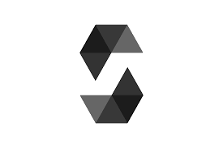

### Hi there 👋

<h1 style="font-size: 2.5rem; font-weight: bold; text-align: center;" align='center'>Hi there! </h1>

👦🏻 Andrés Mayorca | 👨‍💻 FULL STACK WEB DEVELOPER

<h2 style="display: flex; align-items: center; margin-bottom: 1rem;"> About Me</h2>

- 👨‍💻 I am Andrés Mayorca and I am 14 years old
- I am passionate about web development, AI and smart contract development
- I am learning to program
- Currently I would like to work on projects, to gain experience.
- Ask me about: HTML, CSS, Javascript, Solidity and python, flask and django
- I am passionate about sports, especially soccer and tennis
- 💬 I like to spend time in Twitter **[twitter.com/ Andres](https://twitter.com/Andresito_0808)**
- My webiste is **[andresitodev](https://andresitodev.github.io/My-Website/)**

<h2 style="margin: 1rem 0;">📚 My Stack<h3>

 

